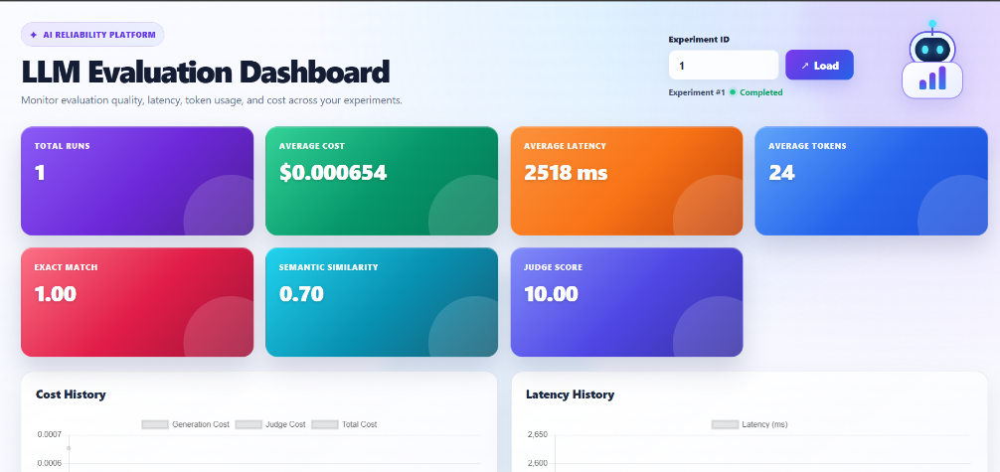
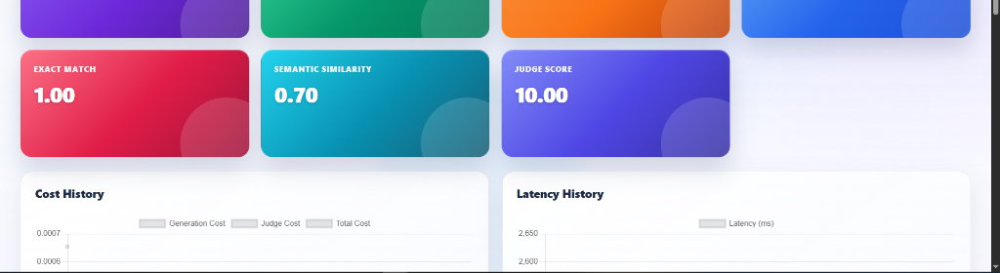
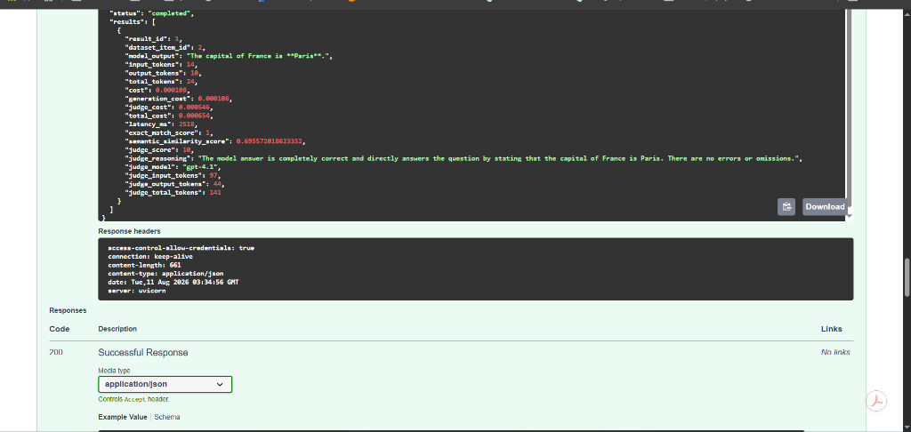

# LLM Reliability & Evaluation Platform

A production-deployed platform for evaluating, monitoring, and analyzing Large Language Model (LLM) responses using normalized exact match, semantic similarity, LLM-as-a-Judge, latency measurement, token tracking, and cost analysis.

The platform provides an end-to-end workflow for creating evaluation datasets, running LLM experiments, measuring response quality, storing results in PostgreSQL, visualizing evaluation metrics, and automatically deploying application changes to AWS through GitHub Actions CI/CD.

---

## Overview

LLM applications are probabilistic systems.

Changes to models, prompts, application logic, or evaluation criteria can affect response quality, latency, token consumption, and cost. Traditional software tests alone are often insufficient for detecting these changes.

The **LLM Reliability & Evaluation Platform** provides a structured evaluation layer for measuring LLM behavior across repeatable experiments.

### Core capabilities

- Evaluation dataset management
- Experiment creation and execution
- OpenAI model integration
- Normalized exact-match evaluation
- Semantic similarity scoring
- LLM-as-a-Judge evaluation
- Judge reasoning and judge token tracking
- Generation and evaluation cost tracking
- Latency measurement
- Persistent PostgreSQL experiment results
- Interactive evaluation dashboard
- REST API with OpenAPI/Swagger documentation
- Docker containerization
- Amazon ECS/Fargate deployment
- Amazon ECR container registry
- Amazon RDS PostgreSQL
- Application Load Balancer
- CloudFront HTTPS API delivery
- AWS Amplify frontend hosting
- GitHub Actions CI/CD
- GitHub-to-AWS authentication using OIDC

---

## Production Dashboard

The frontend provides a consolidated view of experiment quality, performance, and cost.



For each experiment, the dashboard displays:

- Total runs
- Average cost
- Average latency
- Average token usage
- Exact Match
- Semantic Similarity
- Judge Score

Historical visualizations include:

- Cost History
- Latency History
- Judge Score History
- Token History

---

## Experiment Results

Individual result records display the prompt, expected answer, generated response, quality metrics, latency, token usage, and cost.



### Production evaluation example

A fresh experiment was executed against the deployed production backend.

**Prompt**

```text
What is the capital of France?
```

**Expected response**

```text
Paris
```

**Model response**

```text
The capital of France is **Paris**.
```

The production evaluation returned:

| Metric | Result |
|---|---:|
| Exact Match | **1.00** |
| Semantic Similarity | **0.70** |
| Judge Score | **10.00** |
| Total Tokens | **24** |
| Latency | **2,518 ms** |
| Generation Cost | **$0.000108** |
| Judge Cost | **$0.000546** |
| Total Cost | **$0.000654** |

This verifies that the deployed evaluation pipeline correctly recognizes a valid answer contained within a naturally formatted LLM response.

---

## FastAPI Backend

The backend exposes REST APIs for authentication, datasets, experiments, evaluation execution, results, metrics, and dashboard analytics.



The API is implemented with **FastAPI** and exposes interactive OpenAPI/Swagger documentation.

---

## System Architecture

```text
                         ┌──────────────────────┐
                         │      Developer       │
                         └──────────┬───────────┘
                                    │
                                 git push
                                    │
                                    ▼
                         ┌──────────────────────┐
                         │        GitHub        │
                         │      Repository      │
                         └──────────┬───────────┘
                                    │
                              GitHub Actions
                                    │
                                    ▼
                         ┌──────────────────────┐
                         │     AWS IAM OIDC     │
                         │ Federated Identity   │
                         └──────────┬───────────┘
                                    │
                                    ▼
                         ┌──────────────────────┐
                         │      Amazon ECR      │
                         │   Container Images   │
                         └──────────┬───────────┘
                                    │
                                    ▼
                         ┌──────────────────────┐
                         │   Amazon ECS/Fargate │
                         │     FastAPI API      │
                         └──────────┬───────────┘
                                    │
                                    ▼
                         ┌──────────────────────┐
                         │ Application Load     │
                         │      Balancer        │
                         └──────────┬───────────┘
                                    │
                                    ▼
                         ┌──────────────────────┐
                         │     CloudFront       │
                         │      HTTPS API       │
                         └──────────┬───────────┘
                                    │
                                    │ HTTPS
                                    ▼
                         ┌──────────────────────┐
                         │   AWS Amplify Web    │
                         │      Dashboard       │
                         └──────────────────────┘

                                    │
                         FastAPI evaluation data
                                    │
                                    ▼
                         ┌──────────────────────┐
                         │     Amazon RDS       │
                         │     PostgreSQL       │
                         └──────────────────────┘
```

---

## Evaluation Architecture

Each dataset item moves through a multi-stage evaluation pipeline.

```text
Dataset Item
      │
      ▼
Experiment
      │
      ▼
LLM Provider
      │
      ▼
Model Response
      │
      ├────────────────────┐
      │                    │
      ▼                    ▼
Normalized            Semantic
Exact Match           Similarity
      │                    │
      └──────────┬─────────┘
                 │
                 ▼
          LLM-as-a-Judge
                 │
                 ▼
       Token / Cost / Latency
                 │
                 ▼
           PostgreSQL
                 │
                 ▼
             Dashboard
```

The system combines deterministic, semantic, and model-based evaluation signals rather than relying on a single metric.

---

## Normalized Exact Match

A strict string equality check can incorrectly classify a correct LLM answer as a failure.

For example:

```text
Expected:
Paris

Generated:
The capital of France is **Paris**.
```

A naive equality comparison would return `0`.

The platform normalizes response formatting, casing, punctuation, and whitespace before evaluating the result. It can also recognize the normalized expected answer inside a natural-language response.

The production test above returned:

```text
Exact Match: 1.00
```

Automated unit tests protect this evaluator from regressions.

Example cases:

```text
Paris vs Paris
→ 1.0

PARIS vs Paris
→ 1.0

The capital of France is **Paris**. vs Paris
→ 1.0

The capital of France is London. vs Paris
→ 0.0
```

---

## Semantic Similarity

Exact matching alone cannot capture every valid natural-language variation.

The platform therefore calculates semantic similarity between the expected response and the model-generated response.

This provides an additional quality signal when two answers express related meaning using different wording.

The evaluation strategy combines:

```text
Normalized Exact Match
          +
Semantic Similarity
          +
LLM-as-a-Judge
```

---

## LLM-as-a-Judge

The platform includes model-based evaluation for responses that require qualitative assessment.

The judge records:

- Judge score
- Judge reasoning
- Judge model
- Judge input tokens
- Judge output tokens
- Judge total tokens
- Judge cost

Example production result:

```text
Judge Score: 10.00
```

Example judge reasoning:

```text
The model answer is completely correct and directly answers
the question by stating that the capital of France is Paris.
```

---

## Token Tracking

Generation token consumption is recorded for every evaluation:

```text
Input Tokens
Output Tokens
Total Tokens
```

Judge token consumption is tracked separately:

```text
Judge Input Tokens
Judge Output Tokens
Judge Total Tokens
```

This allows quality to be analyzed together with inference consumption.

---

## Cost Tracking

The platform separates generation cost from evaluation cost.

```text
Generation Cost
       +
Judge Cost
       =
Total Evaluation Cost
```

Example:

```text
Generation Cost: $0.000108
Judge Cost:      $0.000546
Total Cost:      $0.000654
```

This allows model quality to be compared with operational cost.

---

## Latency Monitoring

Every model execution records latency.

Latency can be analyzed at both the individual-result and experiment level.

The dashboard includes latency history so performance regressions can be identified alongside quality regressions.

---

## Experiment Lifecycle

A typical evaluation follows this workflow:

```text
Create Dataset
      │
      ▼
Add Dataset Items
      │
      ▼
Create Experiment
      │
      ▼
Select Provider / Model
      │
      ▼
Run Experiment
      │
      ▼
Generate Response
      │
      ▼
Run Evaluators
      │
      ▼
Store Results
      │
      ▼
Analyze Dashboard
```

---

## REST API

### Authentication

```http
POST /auth/register
POST /auth/login
```

### Users

```http
GET /users/me
```

### Evaluations

```http
POST /evaluations
GET  /evaluations
GET  /evaluations/{evaluation_id}
```

### Datasets

```http
GET  /datasets
POST /datasets
GET  /datasets/{dataset_id}
POST /datasets/{dataset_id}/items
```

### Experiments

```http
GET  /experiments
POST /experiments
GET  /experiments/{experiment_id}
POST /experiments/{experiment_id}/run
GET  /experiments/{experiment_id}/results
GET  /experiments/results/{result_id}
```

### Dashboard

```http
GET /experiments/{experiment_id}/dashboard

GET /experiments/{experiment_id}/dashboard/cost-history

GET /experiments/{experiment_id}/dashboard/latency-history

GET /experiments/{experiment_id}/dashboard/judge-score-history

GET /experiments/{experiment_id}/dashboard/token-history
```

### Health Check

```http
GET /health
```

Expected response:

```json
{
  "status": "healthy"
}
```

---

## Create an Experiment

```http
POST /experiments
```

Example request:

```json
{
  "name": "Production Evaluation",
  "description": "Production model quality verification",
  "dataset_id": 1,
  "provider": "openai",
  "model_name": "gpt-4.1"
}
```

Example response:

```json
{
  "id": 1,
  "name": "Production Evaluation",
  "description": "Production model quality verification",
  "dataset_id": 1,
  "provider": "openai",
  "model_name": "gpt-4.1",
  "status": "created"
}
```

---

## Run an Experiment

```http
POST /experiments/1/run
```

The evaluation pipeline automatically:

1. Loads the experiment.
2. Loads the associated dataset.
3. Sends each prompt to the configured LLM.
4. Captures the generated response.
5. Measures latency.
6. Records token consumption.
7. Calculates generation cost.
8. Calculates normalized exact match.
9. Calculates semantic similarity.
10. Executes LLM-as-a-Judge.
11. Records judge token usage.
12. Calculates judge cost.
13. Calculates total evaluation cost.
14. Persists the result in PostgreSQL.
15. Makes the metrics available to the dashboard.

---

## Frontend Dashboard

The frontend provides an interactive interface for analyzing completed experiments.

Users can load an experiment by ID and inspect:

```text
Experiment
   │
   ├── Summary Metrics
   ├── Cost History
   ├── Latency History
   ├── Judge Score History
   ├── Token History
   └── Individual Evaluation Results
```

The frontend is hosted on **AWS Amplify**.

The frontend communicates with the production API over HTTPS through **Amazon CloudFront**.

---

## Database

Experiment data is persisted in **Amazon RDS PostgreSQL**.

Core entities include:

```text
Users
Datasets
Dataset Items
Experiments
Experiment Results
Evaluations
```

Database schema changes are managed using **Alembic migrations**.

Example:

```bash
alembic upgrade head
```

---

## Docker

The backend is packaged as a Docker container.

Build locally:

```bash
docker build -t llm-evaluation-platform .
```

Run:

```bash
docker run -p 8000:8000 llm-evaluation-platform
```

Verify:

```bash
curl http://localhost:8000/health
```

Expected response:

```json
{
  "status": "healthy"
}
```

---

## Local Development

Clone the repository:

```bash
git clone https://github.com/daps-hub/llm-evaluation-platform.git
cd llm-evaluation-platform
```

Create a virtual environment:

```bash
python -m venv .venv
```

### Windows Git Bash

```bash
source .venv/Scripts/activate
```

### Windows Command Prompt

```cmd
.venv\Scripts\activate
```

### macOS/Linux

```bash
source .venv/bin/activate
```

Install dependencies:

```bash
pip install -r requirements.txt
```

Configure the required environment variables.

Then start FastAPI:

```bash
uvicorn app.main:app --host 0.0.0.0 --port 8000
```

Local Swagger documentation:

```text
http://localhost:8000/docs
```

Local health endpoint:

```text
http://localhost:8000/health
```

> `localhost:8000` refers only to a backend running on the developer's local machine. The production application runs separately on AWS.

---

## Environment Variables

The application uses environment-based configuration.

Examples include:

```text
DATABASE_URL
OPENAI_API_KEY
JWT_SECRET_KEY
FRONTEND_ORIGINS
```

The frontend uses a Vite environment variable for the production backend URL:

```text
VITE_API_URL
```

Sensitive values should never be committed to source control.

---

## AWS Production Deployment

The backend is deployed as a Docker container using:

- Amazon ECR
- Amazon ECS/Fargate
- Application Load Balancer
- Amazon RDS PostgreSQL
- Amazon CloudFront
- AWS IAM

The frontend is hosted using:

- AWS Amplify

The production request path is:

```text
Amplify Frontend
      │
      │ HTTPS
      ▼
Amazon CloudFront
      │
      ▼
Application Load Balancer
      │
      ▼
Amazon ECS / FastAPI
      │
      ▼
Amazon RDS PostgreSQL
```

---

## CI/CD

The repository contains automated GitHub Actions workflows for continuous integration and deployment.

A push to the configured deployment branch triggers the pipeline.

### Continuous Integration

```text
Git Push
   │
   ▼
GitHub Actions
   │
   ├── Checkout Repository
   ├── Set Up Python
   ├── Install Dependencies
   └── Run Automated Tests
```

The normalized exact-match evaluator is protected by automated regression tests.

### Continuous Deployment

```text
Successful Source Update
        │
        ▼
GitHub Actions
        │
        ▼
AWS OIDC Authentication
        │
        ▼
Amazon ECR Login
        │
        ▼
Docker Build
        │
        ▼
Push Container Image
        │
        ▼
Retrieve ECS Task Definition
        │
        ▼
Inject New Image
        │
        ▼
Register New Task Revision
        │
        ▼
Deploy ECS Service
        │
        ▼
Wait for Service Stability
```

---

## GitHub Actions + AWS OIDC

The deployment pipeline uses **OpenID Connect (OIDC)** for GitHub-to-AWS authentication.

Permanent AWS access keys are not stored in the GitHub Actions workflow.

Instead:

```text
GitHub Actions
       │
       │ OIDC Identity Token
       ▼
AWS IAM Identity Provider
       │
       ▼
IAM Deployment Role
       │
       ├── ECR permissions
       ├── ECS permissions
       └── Restricted iam:PassRole
```

The IAM trust relationship is restricted to the intended GitHub repository and deployment branch.

This provides short-lived AWS credentials during deployment.

---

## Production Verification

The deployment has been verified end-to-end.

```text
Source Code
    │
    ▼
GitHub
    │
    ▼
GitHub Actions
    │
    ▼
AWS OIDC
    │
    ▼
Amazon ECR
    │
    ▼
Amazon ECS
    │
    ▼
Application Load Balancer
    │
    ▼
CloudFront
    │
    ▼
FastAPI
    │
    ▼
Amazon RDS
    │
    ▼
Evaluation Results
    │
    ▼
Amplify Dashboard
```

The deployed backend health check returned:

```http
HTTP/1.1 200 OK
```

```json
{
  "status": "healthy"
}
```

A fresh production experiment returned:

```text
Exact Match:         1.00
Semantic Similarity: 0.70
Judge Score:         10.00
Latency:             2,518 ms
Tokens:              24
Total Cost:          $0.000654
```

The results were subsequently displayed by the deployed Amplify dashboard.

---

## Technology Stack

### AI & Evaluation

- OpenAI
- LLM-as-a-Judge
- Semantic similarity
- Normalized exact-match evaluation
- Token accounting
- Cost tracking

### Backend

- Python
- FastAPI
- SQLAlchemy
- Alembic
- PostgreSQL
- Pydantic
- Uvicorn

### Frontend

- React
- TypeScript
- Vite
- AWS Amplify

### Cloud Infrastructure

- Amazon ECS/Fargate
- Amazon ECR
- Amazon RDS PostgreSQL
- Application Load Balancer
- Amazon CloudFront
- AWS Amplify
- AWS IAM
- AWS OIDC Identity Provider

### DevOps

- Docker
- Git
- GitHub
- GitHub Actions
- CI/CD
- Pytest

---

## Reliability Engineering Principles

### Evaluation-Driven Development

LLM behavior is evaluated against repeatable datasets instead of relying only on manual inspection.

### Multiple Evaluation Signals

The platform combines:

```text
Deterministic Evaluation
          +
Semantic Evaluation
          +
LLM-Based Evaluation
```

### Regression Testing

Known evaluation behavior is protected by automated unit tests.

### Quality Observability

Quality is analyzed together with:

- Latency
- Tokens
- Generation cost
- Judge cost
- Total evaluation cost

### Reproducible Deployment

Docker provides a consistent runtime environment between development and AWS.

### Automated Delivery

GitHub Actions automatically builds and deploys new application revisions.

### Keyless Cloud Authentication

GitHub OIDC provides temporary AWS credentials without requiring permanent AWS access keys in the deployment workflow.

---

## Current Capabilities

```text
Dataset Management
        │
        ▼
Experiment Management
        │
        ▼
LLM Execution
        │
        ▼
Normalized Exact Match
        │
        ├──────────────────┐
        ▼                  ▼
Semantic Similarity   LLM-as-a-Judge
        │                  │
        └─────────┬────────┘
                  ▼
            Quality Metrics
                  │
                  ▼
         Token / Cost / Latency
                  │
                  ▼
            PostgreSQL
                  │
                  ▼
         Evaluation Dashboard
                  │
                  ▼
        Production AWS System
```

---

## Future Enhancements

Potential extensions include:

- Multi-model comparison
- Prompt-version comparison
- Experiment comparison views
- Evaluation thresholds
- Automated deployment quality gates
- RAG evaluation
- Retrieval quality metrics
- Hallucination detection
- Tool-call evaluation
- Agent trajectory evaluation
- Human evaluation workflows
- Dataset versioning
- Scheduled evaluations
- Quality regression alerts
- Production trace ingestion
- Model performance benchmarking

---

## Why This Project Matters

Building an LLM application is only part of operating a reliable AI system.

Production AI systems also need mechanisms to answer questions such as:

```text
Did model quality improve?

Did a code change introduce a regression?

Is the generated response semantically correct?

How expensive is each evaluation?

How many tokens are being consumed?

Did latency increase?

Can model behavior be measured repeatedly?

Can application changes be deployed safely?
```

This platform brings those concerns together into a single reliability and evaluation workflow.

---

## Engineering Highlights

This project demonstrates hands-on experience with:

- Production LLM evaluation architecture
- AI reliability engineering
- Dataset-driven evaluation
- Experiment management
- Normalized exact-match evaluation
- Semantic similarity
- LLM-as-a-Judge
- LLM cost observability
- Token monitoring
- Latency monitoring
- FastAPI backend development
- SQLAlchemy and PostgreSQL
- Alembic database migrations
- REST API design
- React/TypeScript frontend development
- Docker containerization
- AWS ECS/Fargate
- Amazon ECR
- Amazon RDS
- Application Load Balancing
- Amazon CloudFront
- AWS Amplify
- AWS IAM
- GitHub Actions CI/CD
- GitHub-to-AWS OIDC federation
- Production deployment verification

---

## Security

Sensitive credentials should never be committed to the repository.

Keep values such as these outside source control:

```text
API keys
Database credentials
JWT secrets
AWS credentials
Application secrets
```

GitHub Actions uses AWS OIDC federation so permanent AWS access keys are not required for the deployment workflow.

Production secrets should be stored using an appropriate secrets-management solution such as AWS Secrets Manager or AWS Systems Manager Parameter Store.

---

## Repository

Source code:

https://github.com/daps-hub/llm-evaluation-platform

---

## Author

**Dapo Hammed**

Software Engineer / AI Engineer

Focused on production AI systems, LLM evaluation and reliability, agentic applications, backend engineering, and cloud-native AI infrastructure.